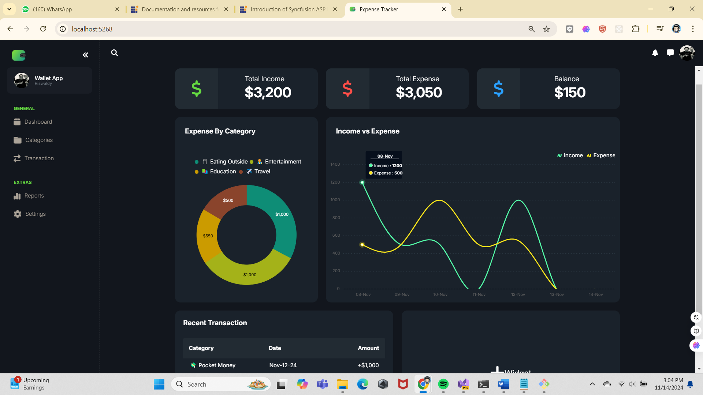

### Dashboard


# Expense Tracker

An application to manage and track daily expenses efficiently. Built with C#, HTML, CSS, and JavaScript, this app aims to help users monitor their spending patterns and improve financial planning.

## Features

- **Add and Edit Expenses**: Easily log and modify expenses.
- **Expense Categorization**: Categorize expenses for better tracking.
- **Data Visualization**: View spending summaries with charts.
- **User Authentication** (if applicable): Secure login for multiple users.

## Technologies Used

- **Backend**: C#
- **Frontend**: HTML, CSS, JavaScript

## Installation

1. Clone the repository:
   ```bash
   git clone https://github.com/Riswaldy/Expense-Tracker.git
